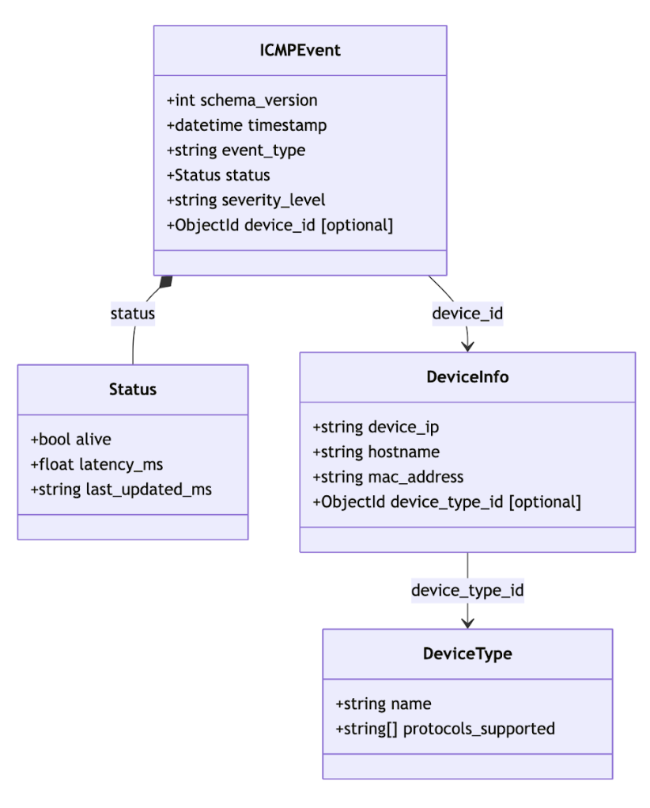

Database Schema
===============

This section documents the Kibble database schema in UML format.

Overview
--------

The database stores information about:

- devices
- device types
- protocol events
- status

Entities
--------

DeviceInfo
~~~~~~~~~~

- ``device_ip``
- ``hostname``
- ``mac_address``
- ``device_type_id``

DeviceType
~~~~~~~~~~

- ``name``
- ``supported_protocols``

Status
~~~~~~~~~~

- ``alive``
- ``latency_ms``
- ``last_updated_ms``

ProtocolEvent
~~~~~~~~~~~~~

- ``_id``
- ``device_id``
- ``protocol``
- ``timestamp``

UML Diagram
-----------
